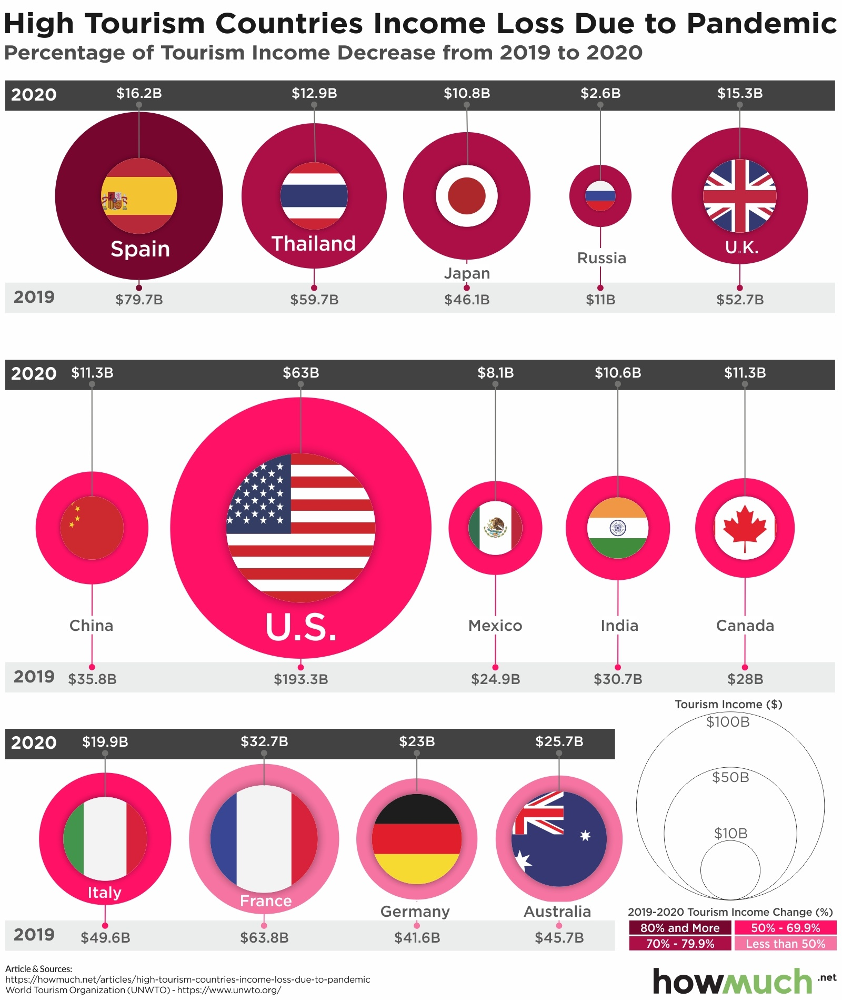

```{css, echo=FALSE}

<!-- define CSS rules to limit the height of code blocks -->

pre {
  max-height: 600px;
  overflow-y: auto;
}

pre[class] {
  max-height: 900px;
}

.scroll-100 {
  max-height: 300px;
  overflow-y: auto;
  background-color: inherit;
}
/*
  Source https://bookdown.org/yihui/rmarkdown-cookbook/html-scroll.html
*/
```

## Question 1:

Please refer the following data visualization about "Negative Economic Impact of COVID-19 on Tourism". For more information, please see the attached article with the HW assignment.

{height="500"}  
image source: https://howmuch.net/articles/high-tourism-countries-income-loss-due-to-pandemic

Please answer the following questions and interpret your findings for each part:

a.  Create a single bar graph displaying the income for each country listed above, with separate bars for 2019 and 2020 positioned side by side for comparison.

b.  Rearrange the bar graph (from part a) so that countries are ordered in ascending order based on their 2019 income.

c.  Create a slope chart to visualize the income differences between 2019 and 2020 for each country. What do you observe?

d.  Create a bar chart highlighting the income differences among countries due to the impact of COVID-19, with bars colored based on the magnitude of the differences.


```{r data prep and cleaning, collapse=FALSE}
# a.
library(readr)
library(tidyverse)
# pull this data from the URL https://data.un.org/ 
# Under the section "Popular statistical tables, country (area) and regional profiles" 
# Scroll down to the "Tourism and transport" section
# See the link for both pdf and csv versions.
# csv: https://data.un.org/_Docs/SYB/CSV/SYB68_176_202511_Tourist-Visitors%20Arrival%20and%20Expenditure.csv
# pdf: https://data.un.org/_Docs/SYB/PDFs/SYB68_176_202511_Tourist-Visitors%20Arrival%20and%20Expenditure.pdf


# I downloaded the csv file to the projects ./data directory

# Note, in the csv file, line includes a header like:
# T31,Tourist/visitor arrivals and tourism expenditure,,,,,,,
# Use skip = n to drop the first n lines and let row n+1 be the first line:
# Using read_csv(url, skip =1) results in this line being first. This is what I want.
# Region/Country/Area,,Year,Series,Tourism arrivals series type,Tourism arrivals series type footnote,Value,Footnotes,Source

# We can use the ./data directory and file.csv name
url <- "data/SYB68_176_202511_Tourist-Visitors_Arrival_and_Expenditure.csv"
tourism_data <- read_csv(url, skip = 1)
glimpse(tourism_data)

# Alternatively, we can simply pull the csv from the URL
tour_url = "https://data.un.org/_Docs/SYB/CSV/SYB68_176_202511_Tourist-Visitors%20Arrival%20and%20Expenditure.csv"
tour_df = read_csv(tour_url, skip = 1)
glimpse(tour_df)


# Create a list of countries in the original
countries = c("Spain", "Thailand", "Japan", "Russia", "U.K.", "China", "U.S.", "Mexico", "India", "Canada", "Italy", "France", "Germany", "Australia")

# sanity check
glimpse(countries)
for (c in countries) {
  print(c)
}

library(dplyr)

## Filter out the countries that are not in our countries vector
tour_df_filtered = tour_df %>%
  filter(...2 %in% countries)

glimpse(tour_df_filtered)


## Filter out years not matching 2019 and 2020
final_df = tour_df_filtered %>%
  filter(Year %in% c(2019, 2020))

# sanity check
glimpse(final_df)

# the final_df looks good, 21 rows 9 columns

```


This is where I am running into an issue, looking at the original image, we see data for both years 2019 and 2020. In my `tour_filtered_df` data frame I only have data for the year 2020 so the plot is inconstant. I ran out of time to finish this up without creating a new data frame by hand from the data in the image though that may have been faster from the start.

## question 1-a
```{r question 1-a, collapse=FALSE}

# Create a vector for the 2020 and 2019 values in the original image
man_2020 = c("16.2", "12.9", "10.8", "2.6", "15.3", "11.3", "63", "8.1", "10.6", "11.38", "19.9", "32.7", "23", "25.7")

man_2019 = c("79.7", "59.7", "46.1", "11", "52.7", "35.8", "193.3", "24.9", "30.7", "28", "49.6", "63.8", "41.6", "45.7")

# sanity check
man_2019
man_2020

# Create a manual data frame, either of the following methods will work.
man_df = data.frame(
  countries,
  man_2019,
  man_2020
)
man_df

manual_df = as.data.frame(cbind(countries, man_2019, man_2020))
manual_df

# convert to numeric
man_2020 <- as.numeric(man_2020)
man_2019 <- as.numeric(man_2019)


df <- data.frame(
  country = rep(countries, times = 2),
  year    = factor(rep(c("2019", "2020"), each = length(countries))),
  income  = c(man_2019, man_2020)
)
glimpse(df)
glimpse(man_df)


## Plot a single bar graph
plot_a = ggplot(df, aes(x = country, y = income, fill = year)) +
  geom_col(position = "dodge") +
    labs(x = "Country", y = "Income", fill = "Year",
       title = "Income by Country: 2019 vs 2020") +
  theme_minimal() +
  theme(axis.text.x = element_text(angle = 45, hjust = 1))


plot_a
```


## Question-2

a. ` Explain what is a ‘Point Estimator’ and a ’ Interval Estimator’.`  
Point Estimators and Interval Estimators are two forms of a population estimation that are calculated based on sample data. These values are our "best guess" for a parameter (from the sample) that represents the parameter of interest in the actual population. They are calculated as a way to predict the parameter of interest of an entire population using only a sample from the population. For example, if the population numbers in the thousands, hundreds of thousands, millions, or more, it may be very difficult to calculate the population mean, average, standard deviation and other parameters of interest. We need a way to predict what the actual population parameter is based on calculating the parameter from a sample of the population which is usually much smaller and easily calculated. 

Point estimators are easier to calculate.
Interval estimators are not as straight forward however more robust. Since the actual population parameter is more likely to be found given a range of values, this method of estimating a population parameter provides confidence that the actual value lies within the range found in the interval. 
 
b. `Do you prefer the ‘Point Estimator’ or the ’ Interval Estimator’. Explain by giving examples.`  
I prefer the Interval Estimator (confidence interval) since they includes the uncertainty regarding an unknown population parameter and more information since they combine a best guess (point estimator) as well as a margin of error along with our confidence level that the true parameter of interest (which is unknown) lies in this range.
In short, the Interval Estimator includes itself as well as all the information in the Point Estimator, this extra inclusion makes it a natural choice of which one to prefer over the easier to calculate Point Estimator. 


c. `What is a ‘Confidence Interval’ and what does 95% confidence interval mean?`  
A confidence interval is a range of values we can calculate from sample data. The goal is that this range includes the actual population parameter of interest since we can not usually sample the entire population due to size or time constraints or other reasons. The interval usually starts with a point estimate, then a margin of error is added on both ends to create an interval.

A 95% confidence interval means that if we repeated the estimate and interval calculation many times, then 95% of the times the unknown population parameter will be in this interval. A common misconception regarding the idea of a 95% CI is to think that it means:
  `"we are 95% probability that the true parameter lies within this range"` 
However, this is not true since the interval dose not indicate the chance of finding the unknown population parameter, it is rather a reference to the the process 

of finding the range and indicates how confident we are that the unknown parameter lies in this range.

Excerpt taken from Dr. Brenda Betancourt STAT-521 class notes taken in Autumn 2025 defining confidence interval:
```txt
"A confidence interval is a plausible range of values for the population parameter"  

"Using only a point estimate to estimate a parameter is like fishing in a
murky lake with a spear, and using a confidence interval is like fishing
with a net."  

"If we report a point estimate, we probably will not hit the exact
population parameter. If we report a range of plausible values – a
confidence interval – we have a good shot at capturing the parameter"
```


d. `What is ‘Hypothesis Testing’?`  
Hypothesis testing is a method used in statistics to determine weather there is enough evidence in a set of sample data to support a claim, belief, or theory about a population parameter. To conduct a hypothesis test, you will start with two hypotheses, one "null" and one "alternative". The null hypothesis is the established claim being tested and the alternative hypothesis is used to find evidence to disprove the null hypothesis. 

Next, choose a significance level, alpha, which creates a threshold for rejecting the null hypothesis. The most common value used is 0.05, meaning you will accept a 5% chance of acknowledging a difference in the sample data which dose not actually exist in the population.

Finely a p-value or critical value is used to decide weather enough evidence exists to reject the null hypothesis. This value indicates the probability of observing results found if the null hypothesis were true. A large p-value means that the results are not likely and smaller p-values mean stronger evidence against the null.

Hypothesis tests can be one of two types. A "two tailed" looks for difference in either direction above or below the the null value, and a "one tailed" which only test for a specific difference in one direction, either higher or lower, but not both.

If the p-value is less than alpha, reject the null and if p-value is greater than alpha fail to reject the null.


e. `How does Hypothesis testing used in Data science. Explain by using real-life examples.`  

In real life hypothesis tests are used in pharmaceutical trials to see weather drugs have a significant effect on a given indication. The effect measured may be weather the drug can be used to reduce cholesterol, create a measured effect on blood glucose and insulin relationship, lower blood pressure among many others. 


f. `What are the potential errors in Hypothesis testing ?`  
Type 1 and Type 2 errors can occur during the hypothesis testing when we make conclusions from a sample representing a population.

A type 1 error is when we reject the null hypothesis when it is true and a type 2 error is when we fail to reject the null even though it is false.


g. `Suppose that, in a hypothesis test, the null hypothesis is in fact true. Is it possible to make a ‘Type 2’ error. Explain.`  
No, if the null hypothesis is true a type 2 error is impossible. A type 2 error occurs when a hypothesis test fails to reject the null hypothesis despite the true population parameter differing from the hypothesized parameter's value. Since committing a type 2 error requires the null hypothesis to be false, it logically can not happen when the null is true.

h. `Explain the difference between the ‘significance level’ and the ‘confidence level’ and identify the  relationship between them.`  

The significance level, alpha, is the probability threshold used in hypothesis testing to decide weather to reject the null hypothesis. It represents the highest level of chance of making an error.

The confidence level is the probability that a confidence interval, constructed by repeated sampling, will contain the true population parameter. It reflects how reliable the estimation procedure is through many iterations.

The two are related by the following calculation:
Confidence level = 1 - Significance level = 1 - alpha


i. `What is the ‘rejection region’ in Hypothesis testing and what is the ‘P-value’?`  

The rejection region is an area that fails to support the null hypothesis. When a calculated result falls into this area during a hypothesis test, the results are considered statistically significant and you to reject the null hypothesis. This area lies in the tails of a distribution and are determined by the significance level alpha.

The P-value is the probability of getting a result as extreme as our results assuming the null hypotheses is true.


j. `If it is important not to reject the true null hypothesis, should the hypothesis test performed at a smaller significance level? If the P-value for the hypothesis test is 0.044. Decide the significance level that you select and the decision.`  

Yes if it is critical that we do not make a type 1 error by rejecting the null hypothesis when it is true, then the test should be preformed at a smaller significance level (alpha). Smaller alpha values requires stronger evidence against the null in order to reject the null which decrease the odds of incorrectly rejecting it. 

Recall that the p-value is the probability of getting a result as extreme as ours under the assumption that the null hypothesis is true. Using a standard significance level of 0.05 and finding a p-value of 0.044 leads us to reject the null hypothesis since the calculated p-value of 0.044 is less than the standard significance level of 0.05.


